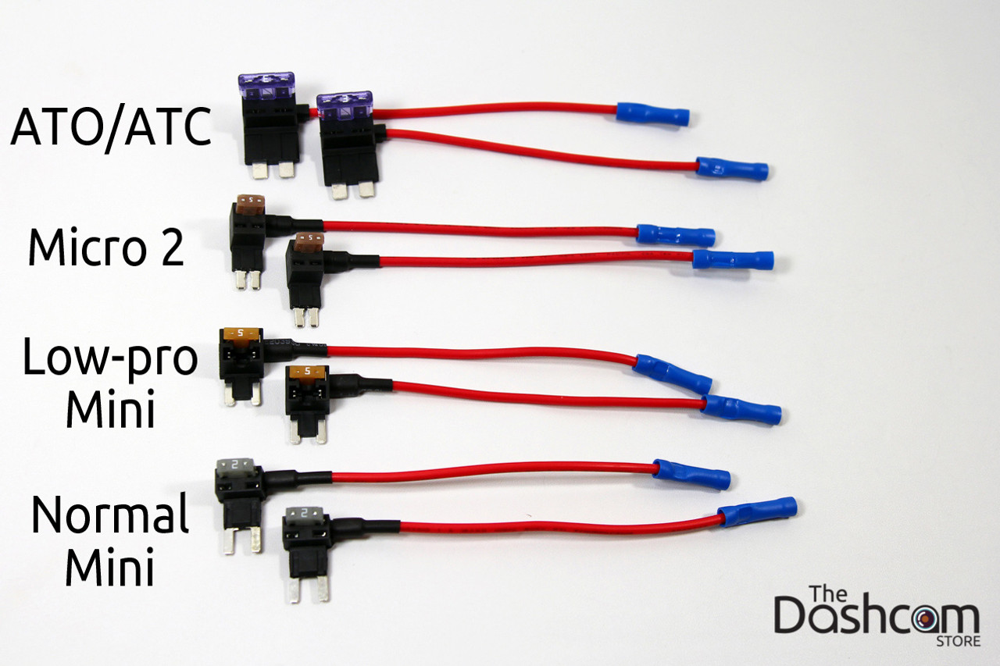
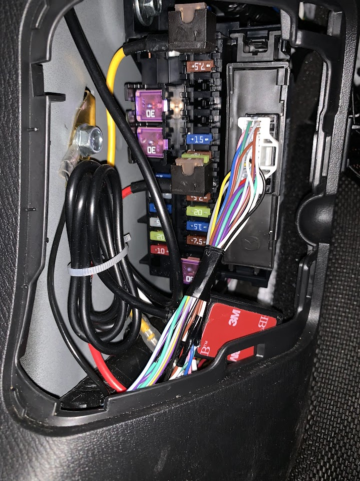
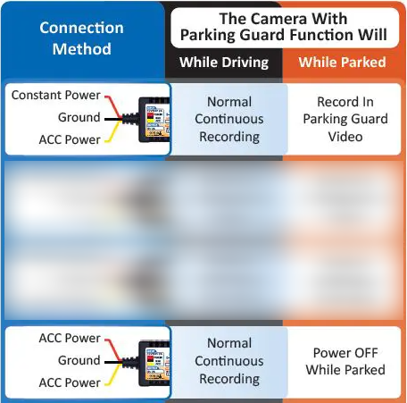
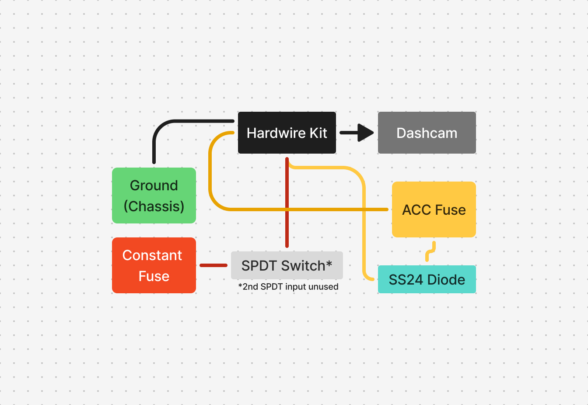
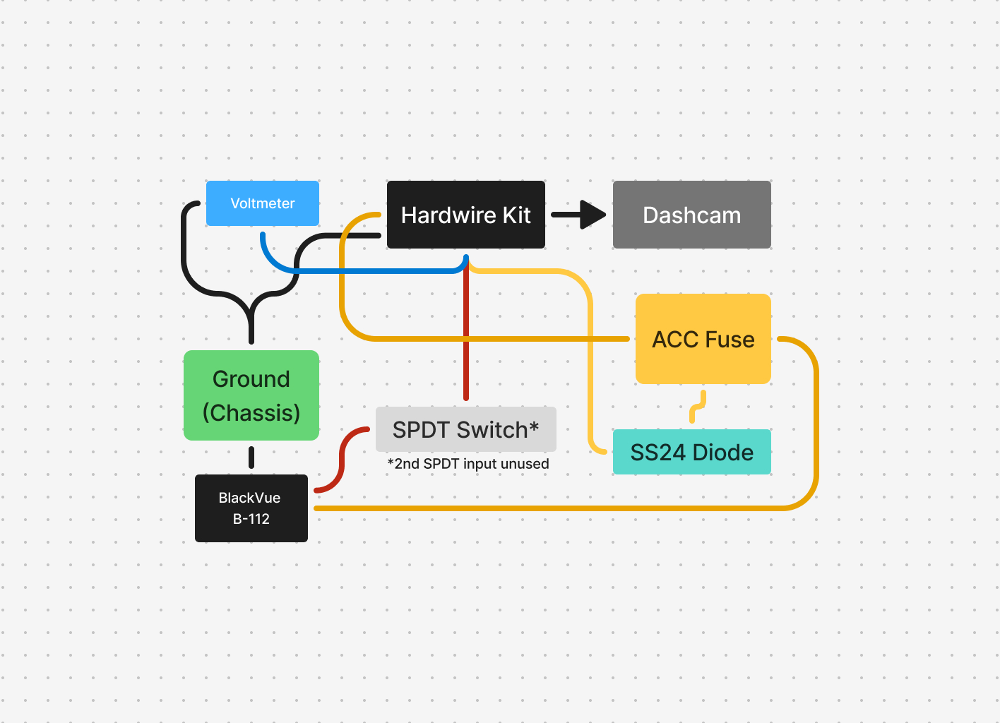
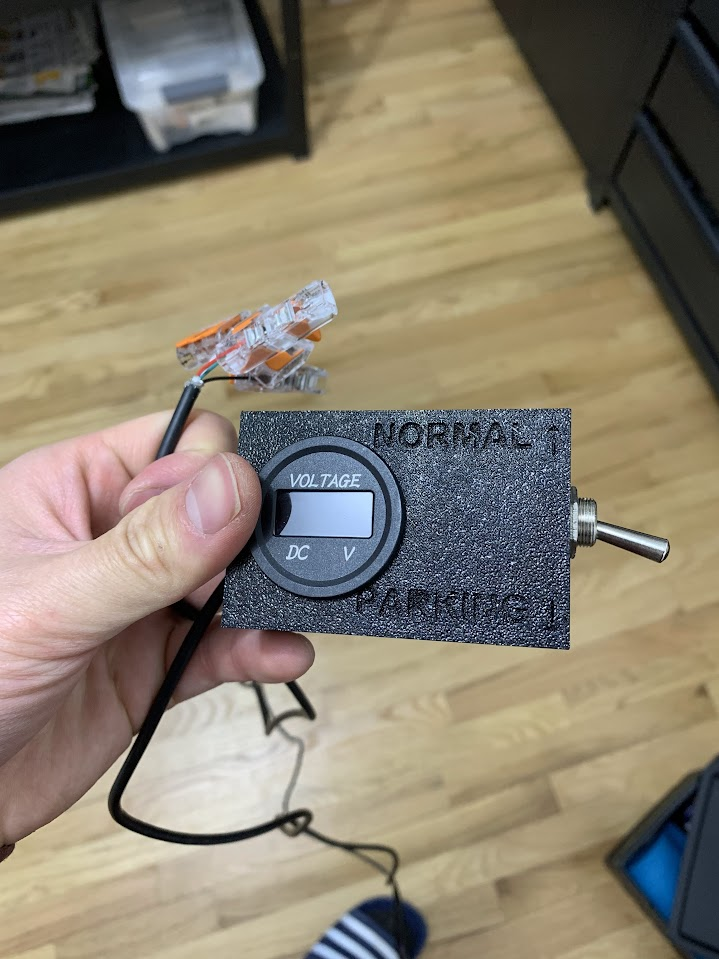

## Initial Installation

Earlier this month, I decided that I wanted a more sophisticated dashcam setup for my second-generation Mazda CX-5. Mostly, I wanted the parking mode feature, which is basically a cheaper version of Tesla's [Sentry Mode](https://www.notateslaapp.com/tesla-reference/1303/tesla-sentry-mode-what-it-is-how-to-use-it-and-battery-drain), to record any incidents that occur when the vehicle's engine is off, such as when parked on the street or in a parking garage. I opted for a [Rove R2-4K Dual](https://www.amazon.com/ROVE-R2-4K-DUAL-STARVIS-Included/dp/B0D6J5B98H)[^1], and the installation went pretty smoothly. I followed this video pretty closely for the install:



[^1]: I won’t speak to the quality of this dashcam just yet since I haven't had the time to fully utilize all its features. I will mention, though, that there was a minor software annoyance that caused the rear dashcam to show up mirrored on the display. The playback of both cameras works well, and the Rove support team was pretty helpful in sending me a replacement. It did not solve the issue, but it's good to know their customer support is at least responsive and helpful.

At this point, you're pretty much good to go with a working dual dashcam setup. However, since this dashcam had the parking mode feature I was looking for, I needed to go a step further and install a hardwire kit.

## Hardwire Kit

The point of the hardwire kit is to "tap" directly into a vehicle's fuse box for power even when the car is off. There are accessories and components in every modern vehicle that stay on even when the engine's power is cut, with the dashcam's parking mode being one of them. The hardwire kit comes with various-sized "add-a-circuit" fuse taps, so the idea is basically to identify the type of fuse that's currently plugged in, replace it with the add-a-circuit tap, and add the existing fuse back into the add-a-circuit. Here are the four most common fuse shapes (for fuse tapping) found in almost all cars:

It turns out that the CX-5 uses low-profile mini fuses (second from the bottom), so we'd simply use the low-profile mini add-a-circuit from the kit. When installing the fuse tap, however, I realized that it didn’t fit properly. The tap would jut out because there were a couple of small plastic hooks protruding from the sides of each slot, which I assume are there to act as extra security for the existing fuse. This would cause the tap to fall out with even the slightest nudge. The solution here is simply to use the normal mini tap that also came with the kit (pictured last). Alternatively, one can be shortsighted and use a pair of pliers to twist off the pieces of plastic in the fuse box (please don't be like me).

_Fuse taps installed. If your model is anything like mine: the yellow (ACC) is installed on Fuse 9 (15A) labeled F.OUTLET [Accessory sockets]. The red (constant) is installed on Fuse 16 (20A) labeled PLG [Power liftgate]. And of course, black is grounded to chassis with the bolt on the left._

## Parking Mode

The [hardwire kit](https://www.amazon.com/dp/B0B7235VLX) has different voltage cutoffs, ranging from 11.8V to 12.4V. The idea here is that if the car battery gets below the set voltage, the kit will automatically cut the pwoer to the dashcam so that it doesn't consume any more power, and one would still be able to start the car. This detail is important to know for later. The kit has three colored wires, and this is how each of them should be wired to change the behavior of the dashcam:

In non-parking mode (pictured at the bottom), both the yellow and red wires are connected to the ACC fuse so that when the vehicle is off, the wires stop receiving power and the dashcam shuts off.

In parking mode (pictured at the top), the red wire is attached to a constant power source, allowing power to be supplied even when the vehicle is off. The dashcam detects the presence/absence of the yellow ACC wire to determine the vehicle state and toggle parking mode accordingly.

## Manual Toggling

Normally, the parking mode configuration works well and would be the finish line for those looking to enable parking mode on their dashcam. But there are some drawbacks to keeping parking mode on constantly:

- **Battery drain**: Parking mode can drain the car battery over extended periods.
- **False recordings**: Wind, small vibrations, or passing shadows can trigger unnecessary recordings.
- **Unnecessary use**: If the vehicle is in a secure garage, parking mode is redundant.

That last point is the one that resonates with me the most---my personal situation calls for the ability to toggle parking mode on and off easily since my vehicle stays in a garage approximately 80% of the time (_wildly non-verifiable estimate_). In order for this toggling to happen, we'd have to be able to switch between an ACC source and a constant source, both feeding into the hardwire kit's red wire (but ensuring power delivery is mutually exclusive).

### Oooh, Shiny

Ever seen those shiny, silver toggle switches in airplane cockpits? The ones that overwhelm you at first glance (and probably at all glances thereafter)? They're called electromechanical toggle switches:

I wanted something similar for my dashcam toggle. The idea is to modify the red wire input of the hardwire kit so that it can accept either ACC power or constant power. This would effectively allow me to toggle between the non-parking and parking modes for the dashcam without ever having to touch the actual settings from within the Rove menu itself. These toggle switches come in a variety of configurations depending on the use case, but the two most popular are:

1. **SPST (Single Pole Single Throw):** Basically a simple on/off switch.
2. **SPDT (Single Pole Double Throw):** Controls a single circuit but can toggle between two different inputs/outputs.

Since we've already covered that only the red wire will need to be switched between two sources, we'll go with the SPDT[^2].

[^2]: Note that the SPST can work just as well if the input into the SPST is the constant power source and the ACC line (yellow wire) is connected with a diode to the SPST output line (red wire). You'll see that I backtrack and the SPST would've been sufficient in the next section.

### The "Break-Before-Make" Problem

Most SPDT toggle switches are [break-before-make (BBM)](https://www.analog.com/en/resources/glossary/break-before-make.html) devices, which causes a temporary power gap. During testing, this "feature" reared its ugly head—the dashcam would momentarily lose power, causing it to reboot every time I switched between ACC and constant power. There are three possible solutions to this:

1. **Use a "Make-Before-Break" (MBB) SPDT Switch.** Unlike BBM switches, an MBB switch briefly connects both power sources before disconnecting the previous one.  
   **Why didn’t this work?** These are very hard to come by, if not impossible. Most spec sheets won't even list whether the switch is MBB or BBM.

2. **Add Capacitors to Bridge the Power Gap.** Capacitors across the red wire and ground act as a temporary power source, keeping the dashcam alive while switching.  
   **Why didn’t this work?** The sizing of these capacitors based on the dashcam's power draw of up to 1A at 12V means that I needed four cartoonishly large capacitors that took up far too much space.

3. **Use a Diode to Automatically Bridge ACC Power.** This approach uses the existing ACC line and a Schottky diode to prevent backfeed: we feed ACC to the red line so that it'll only get ACC when the toggle is off but receive constant 12V when the toggle is on. The diode will prevent backfeed into the ACC fuse when the toggle is switched on.  
   **Why didn’t this work?** It worked.

Now that we're bridging the power gap with ACC power, it turns out that our SPDT toggle was overkill anyway, and we don't need the 2nd power source from ACC since we're connecting that directly to the existing output of the switch. We could've actually gotten away with an SPST. Here's a rudimentary wiring diagram of what we have so far:

_Yes, I use Figma for wiring diagrams. No, I don't do autographs._

### The "My Car Battery Is Not Swole Enough" Problem

At this point of the project, I was pretty proud of myself. I'd gotten all the elctronics down, the dashcam was working flawlessly, and i was able to effortlessly toggle between the non-parking and parking modes without the camera rebooting. now, i just had to put it to the test. after a long drive to have dinner with family for chinese new year's, i parked the car into the garage and turned on parking mode to see how long it would actually record. i'd set it to the timelapse mode, and at 1 FPS, my conservative estimates put it in the range of recording for a couple hours to about 6 hours worth of footage condensed into (at a minimum) a 4 minute video that i would be able to play back. imagine my surprise when i came back the next day and there was only an 11 second clip, which equates to parking mode running for only 5.5 minutes. actually, i wasn't suprised---mainly just disappointed. i had a sneaking suspicion that the factory-installed aging battery on my Mazda would not be up to the task for a parking dashcam. of course, i'd also already checked with a multimeter that it wasn't the hardwire kit that was faulty since indeed the battery was at the cutoff point when the dashcam shuts off. this is the part where i should've stopped shelling out money for more electrical equipment and the like, but it's unfortunately not.

To solve this issue, I purchased an external battery pack ([BlackVue B-112](https://www.amazon.com/dp/B01HFRH34Q?ref=ppx_yo2ov_dt_b_fed_asin_title)) specifically made for dashcams with parking modes such that it now becomes the sole source of power when the engine is off, instead of the actual battery of the vehicle. I also decided to purchase a cheapo voltage meter I could hook up to check on how much voltage the dashcam was pulling at any given time, just to provide extra transparency about battery behavior. The wiring diagram now looks like this:

_Notice how the constant fuse tap is completely gone and we solely rely on the B-112 to be the source of 12V constant._

### Prettifying it all

Now all that's left to do is wire management and to 3D print a nice little container for the toggle switch and voltmeter. Here's how those came out:

_Switch downward to activate parking mode. Switch upward to return to non-parking mode. The direction was somewhat arbritarily; I chose downward as the parking mode since there's less risk of an item dropping onto the toggle and accidentally shutting off power mode when it was meant to be on. The opposite is less of a concern (turning parking mode on accidentally)._
