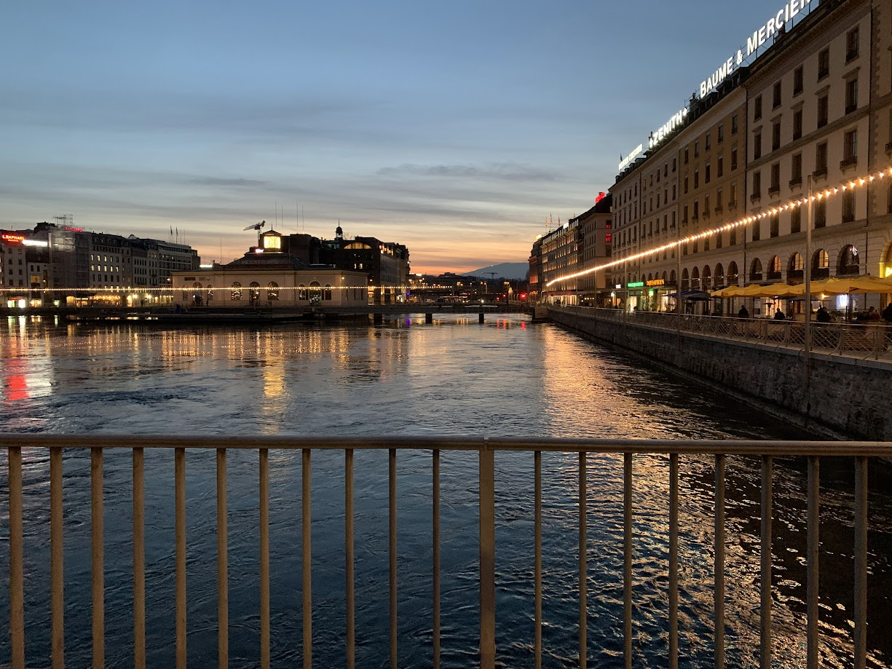
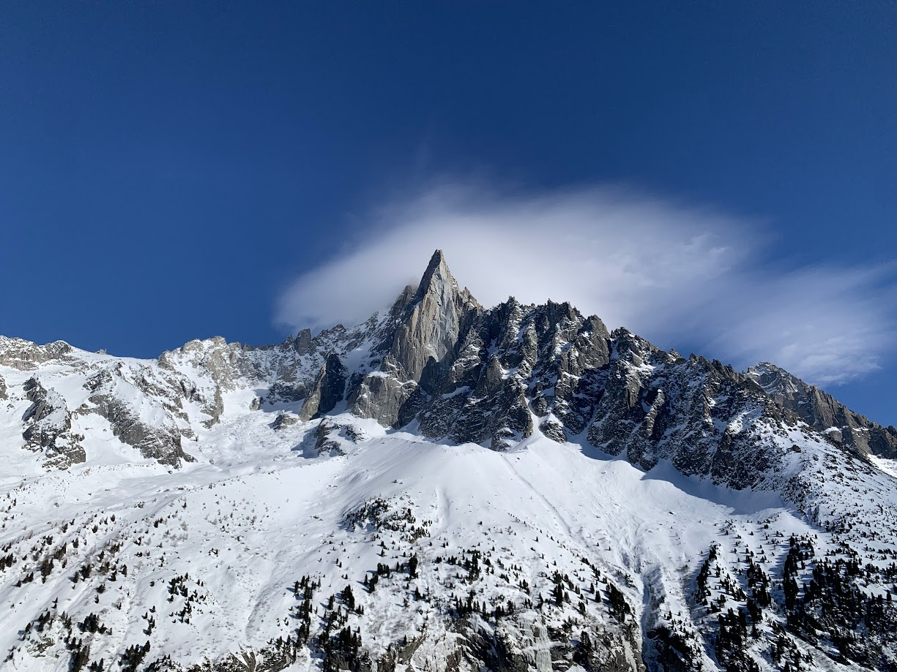
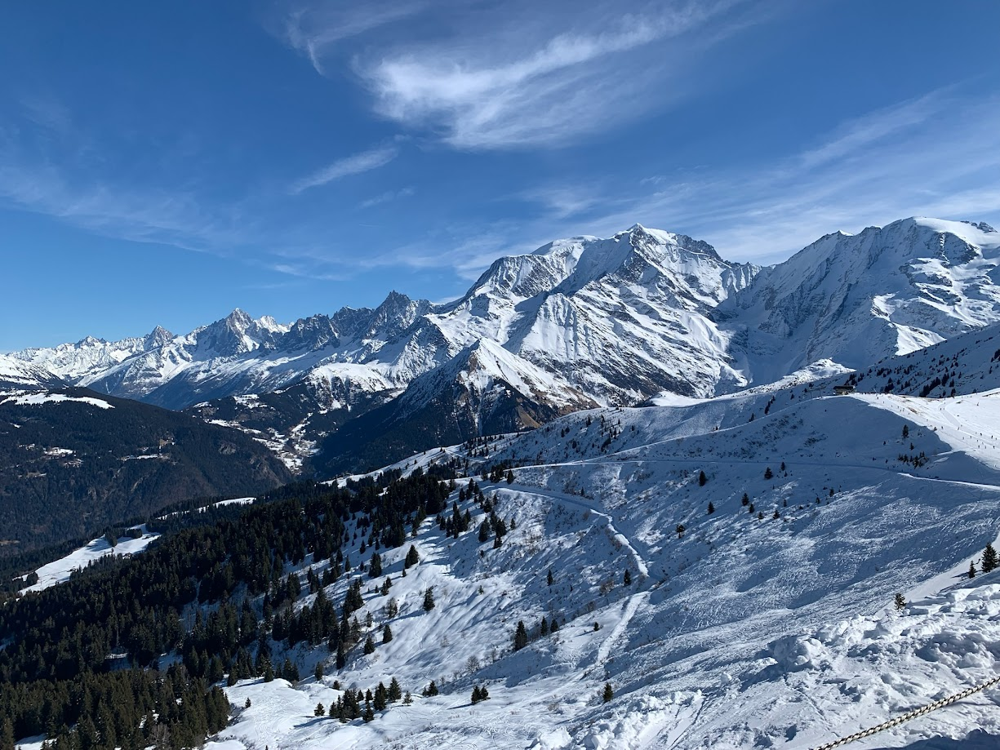
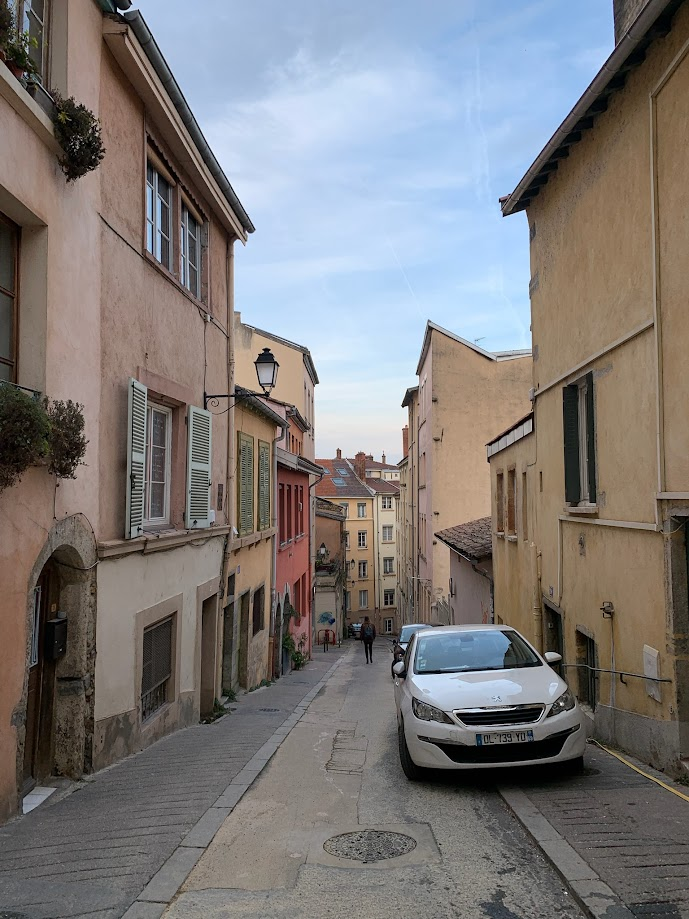

We started in Geneva for a couple of days, and travelled to a small commune in France called Sallanches. It was in close proximity to the ski areas of Chamonix and Saint-Gervais-les-Bains, both of which we visited throughout the week. Our trip ended with a few days in Lyon before heading back to the States.

---

_[46.206446, 6.146724 - Geneva, Switzerland] // On the Pont des Bergues bridge_

---

_[46.2012115, 6.1470168 - Geneva, Switzerland] // Some nice cannons and artwork at L'Ancien Arsenal_

---

_[45.932745, 6.917334 - Chamonix, France] // A view of the stunning Aiguille du Dru from within the cable car taking us up to Gare du Montenvers to see Mer de Glace_

---

_[45.93019, 6.9220146 - Chamonix, France] // Exploring the ice caves of Mer de Glace (Grotte de Glace)_

---


_[45.846336, 6.676628 - Saint-Gervais-les-Bains, France] // Alex and Phil abandon us on their fancy parachutes while we cry down the diamonds_

---

_[45.846336, 6.676628 - Saint-Gervais-les-Bains, France] // The view near the La Folie restaurant on Mont-Joly_

---

_[45.757300, 4.823747 - Lyon, France] // A calm walk down an alleyway after visiting the Notre-Dame de Fourvière_
